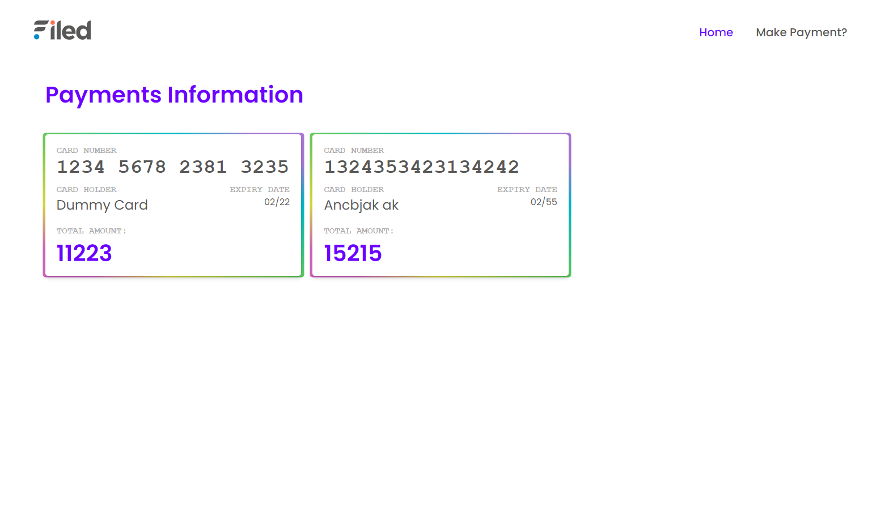
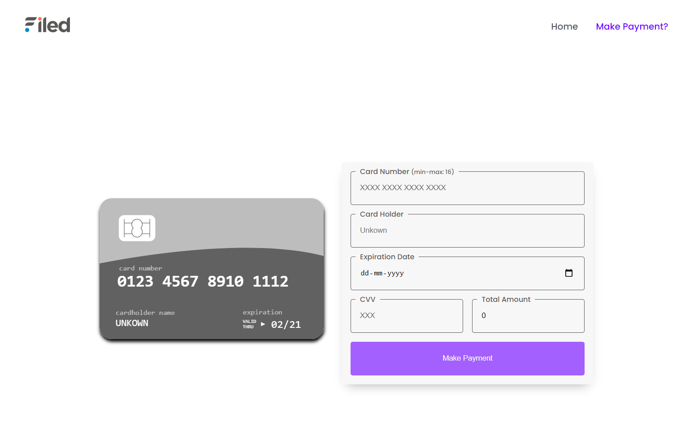

# Assignment - Filed

## 🛠 Installation & Set Up

1. Clone the repo

   ```sh
   git clone https://github.com/keiken-shin/filed_assignment.git
   ```

2. Install dependencies

   ```sh
   npm i
   ```

3. Start the development server and open in browser

   ```sh
   npx ng serve -o
   ```

## Below are some screenshots



